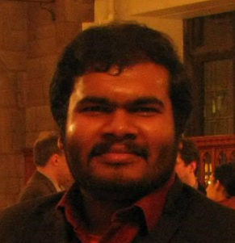

{:#mypicture}

Sixth Year Graduate Student  
[Department of Mathematics](http://math.uchicago.edu)  
[The University of Chicago](http://www.uchicago.edu)  
[5734 S. University Avenue, Chicago, Il-60637](https://maps.google.com/maps?q=5734+S.+University+Avenue,+Chicago,+Il-60637)

**Office:** Eckhart 3  
**Phone:** 773-490-5763  
**Email:** `subhadip` at `math` dot `uchicago` dot `edu`    
**My advisor:** [Danny Calegari](http://math.uchicago.edu/~dannyc/)

{:#university_shield}

## Curriculum Vitae

My CV is available [here](assets/CV.pdf).

Also here are my [Research Statement](assets/Research_Statement.pdf) and [Teaching Statement](assets/Teaching_Statement.pdf) as of Fall 2017.

## Research interests and background

I am currently interested in various Topological and Dynamical properties of Group of homeomorphisms of Circle and related problems in low dimensional Dynamics, Geometry, Topology and Geometric Group Theory.

My papers and preprints are on my [research page](research).

I was an undergraduate at [Indian Statistical Institute, Bangalore Centre](http://www.isibang.ac.in/).

## Teaching
In Winter 2018, I am teaching [Math 195](teaching/Winter2018.195) (Math. methods for social Sciences).
Older teaching is listed on my [teaching page](teaching).

