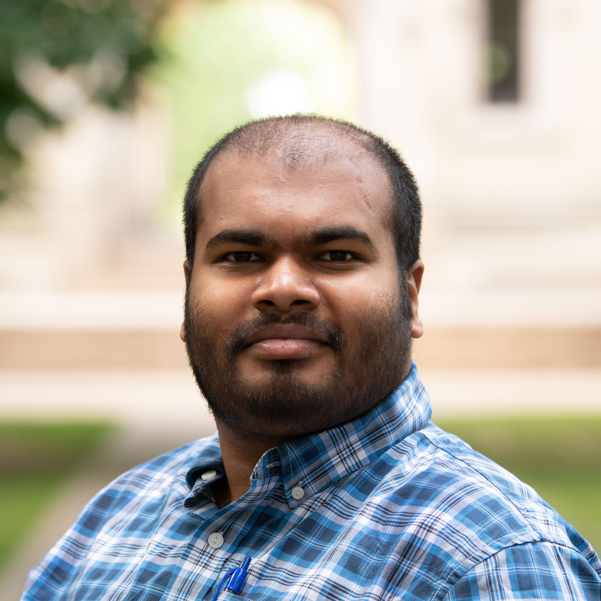
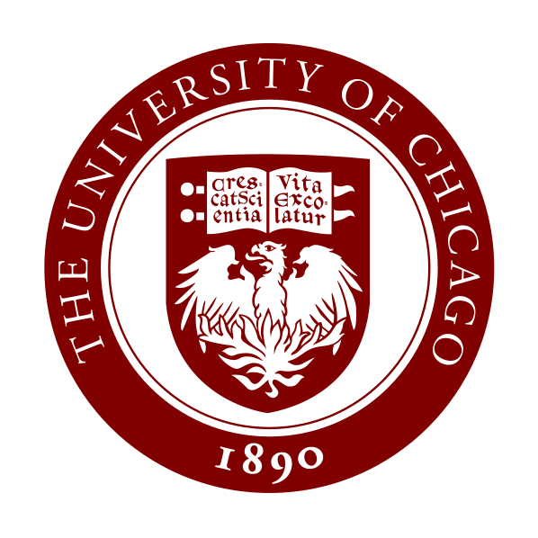

| <i class="fa-solid fa-user-tie"></i> | Assistant Instructional Professor |
| <i class="fa-solid fa-building-columns"></i> | [The University of Chicago](https://www.uchicago.edu)  |
|        |    |
| <i class="fa-solid fa-map-location-dot"></i> | Eckhart 120B |
| <i class="fa-solid fa-phone-volume"></i> | 773-702-7398 |
| <i class="fa-solid fa-envelope"></i> | subhadip `at` uchicago `dot` edu (Academic)|
| <i class="fa-regular fa-envelope"></i> | 20empyrwy `at` mozmail `dot` com (Non-academic)|
|        |    |
| <i class="fa-solid fa-file-pdf"></i> | [CV (Summer 2024)](assets/CV.pdf) |

  

  
  
  

  

  
   
   
   
  

## Biography

I am currently an [Assistant Instructional Professor](https://mathematics.uchicago.edu/people/profile/subhadip-chowdhury/) in the [Department of Mathematics](https://mathematics.uchicago.edu/) at the [The University of Chicago](https://www.uchicago.edu/) and in the [Neubauer Phoenix STEM Scholars program](https://college.uchicago.edu/phoenix-stem) at the [Office of Research and Teaching Innovations](https://college.uchicago.edu/academics/office-research-and-teaching-innovations).

### Appointments ###

* Assistant Instructional Professor   
  _The University of Chicago, 2023 - Present_
* Visiting Assistant Professor   
  _The College of Wooster, 2020 - 2023_
* Visiting Assistant Professor   
  _Bowdoin College, 2018 - 2020_

### Education ###

* Ph.D. in Mathematics, 2018 
  _University of Chicago_
* M.S. in Mathematics, 2014 
  _University of Chicago_
* B.Math.(Hons.), 2012 
  _Indian Statistical Institute_

## Teaching and Pedagogy

My current pedagogical interests revolve around developing inquiry-based, collaborative, inclusive, and active learning in classroom that engages students from diverse backgrounds effectively. I also work on creating and implementing formative assessments and alternate grading techniques that reward growth and persistence.

During June 2024 - May 2025, I am supported by a <i>UChicago College Curricular Innovation Fund grant</i> to implement Collaborative Learning in the Mathematics department.

Course syllabi and lecture notes for my past courses are accessible through the [teaching page](teaching). The page also links to my philosophy statements and portfolio.

## Research Interests

My primary research area is low-dimensional topological dynamics, especially the theory of nonabelian group actions on the circle. I have also contributed to the theory of formal languages, aiming to solve combinatorial group theory problems using topological methods. I am broadly interested in topics related to geometric group theory, complex dynamics, and big mapping class groups. 

I received my Ph.D. from the University of Chicago under the direction of Prof. [Danny Calegari](http://math.uchicago.edu/~dannyc/). My papers and preprints are linked on my [research page](research).

