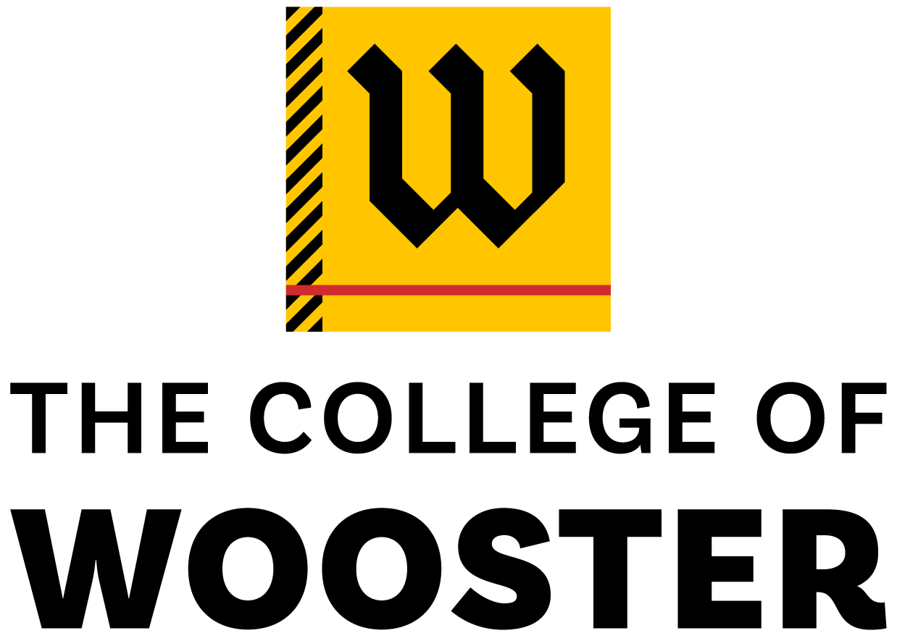

|        | Visiting Assistant Professor |
|        | [The College of Wooster](https://www.wooster.edu/)  |
|        |    |
| Office: | Taylor 307 |
| Phone: | 330-263-2473 |
| Email: | `schowdhury` at `wooster` dot `edu` |
|        |    |
| CV: | <i class="far fa-file-pdf"></i> [pdf (Fall 2022)](assets/CV.pdf) |

  

     
   
  

  

  
   
   
   
  

## Biography

I am currently a Visiting Assistant Professor in the [Mathematical & Computational Sciences Department](https://wooster.edu/area/mathematics/) at [The College of Wooster](https://wooster.edu/). I received my Ph.D. from University of Chicago under the direction of Prof. [Danny Calegari](http://math.uchicago.edu/~dannyc/). 

### Experience ###

* Visiting Assistant Professor   
  _The College of Wooster, 2020 - Present_
* Visiting Assistant Professor   
  _Bowdoin College, 2018 - 2020_
* Instructor of Record  
  _University of Chicago, 2014 - 2018_

### Education ###

* Ph.D. in Mathematics, 2018 
  _University of Chicago_
* M.S. in Mathematics, 2014 
  _University of Chicago_
* B.Math.(Hons.), 2012 
  _Indian Statistical Institute_

## Research Interests

My primary research area is low dimensional topological dynamics, especially the theory of nonabelian group actions on the circle. I have also made contributions to the theory of formal languages, with an aim to solve combinatorial group theory problems using topological methods. I am broadly interested in geometric group theory, complex dynamics, and big mapping class group related topics as well.

My papers and preprints are on my [research page](research).

## Teaching

In Spring 2023, I am teaching _Chaotic Dynamical Systems_, _Mathematical Foundations of Computing_, and  _Applied Differential Calculus_. The course syllabis are accessible through the [teaching page](teaching). Older teaching is listed there as well.

