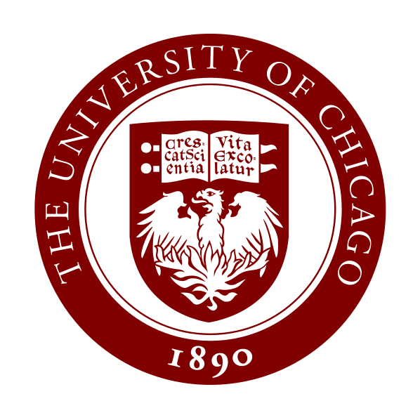

|        | Assistant Instructional Professor |
|        | [The University of Chicago]()  |
|        |    |
| Office: | Eckhart 120B |
| Phone: | 773-702-7398 |
| Email: | subhadip `at` uchicago `dot` edu |
|        |    |
| CV: | <i class="far fa-file-pdf"></i> [pdf (Autumn 2023)](assets/CV.pdf) |

  

  
  
  

  

  
   
   
   
  

## Biography

I am currently an Assistant Instructional Professor in the [Physical Sciences Collegiate Division](https://college.uchicago.edu/academics/physical-sciences-collegiate-division) and the [Department of Mathematics](https://mathematics.uchicago.edu/) at [The University of Chicago](https://www.uchicago.edu/). I received my Ph.D. from the University of Chicago under the direction of Prof. [Danny Calegari](http://math.uchicago.edu/~dannyc/).

### Experience ###

* Assistant Instructional Professor   
  _The University of Chicago, 2023 - Present_
* Visiting Assistant Professor   
  _The College of Wooster, 2020 - 2023_
* Visiting Assistant Professor   
  _Bowdoin College, 2018 - 2020_

### Education ###

* Ph.D. in Mathematics, 2018 
  _University of Chicago_
* M.S. in Mathematics, 2014 
  _University of Chicago_
* B.Math.(Hons.), 2012 
  _Indian Statistical Institute_

## Research Interests

My primary research area is low-dimensional topological dynamics, especially the theory of nonabelian group actions on the circle. I have also made contributions to the theory of formal languages, with an aim to solve combinatorial group theory problems using topological methods. I am broadly interested in geometric group theory, complex dynamics, and big mapping class group related topics as well.

My papers and preprints are on my [research page](research).

## Teaching

 
The course syllabi are accessible through the [teaching page](teaching). Older teaching is listed there as well.

