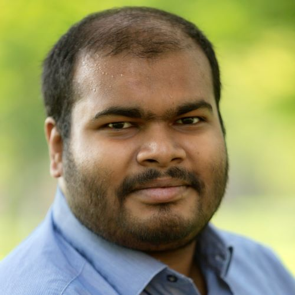

  <canvas class="hero-bg" id="hero-canvas"></canvas>
  

    
  

  

    <h2>Subhadip Chowdhury</h2>
    

      Assistant Instructional Professor 
      <a href="https://mathematics.uchicago.edu/" style="color: #3EB1C8;">Department of Mathematics</a>, <a href="https://www.uchicago.edu/" style="color: #3EB1C8;">The University of Chicago</a>
    

    <ul class="hero-contact">
      <li><i class="fa-solid fa-envelope"></i> subhadip <code style="background:transparent;color:#ccc;padding:0;">at</code> uchicago <code style="background:transparent;color:#ccc;padding:0;">dot</code> edu</li>
      <li><i class="fa-solid fa-location-dot"></i> Eckhart 120B &middot; 5734 S. University Ave, Chicago, IL 60637</li>
      <li><i class="fa-solid fa-file-pdf"></i> <a href="assets/CV.pdf">CV (Autumn 2025)</a></li>
    </ul>
  

  

    

      
    

    

      
      
      
    

  

## Biography

I am an [Assistant Instructional Professor](https://mathematics.uchicago.edu/people/profile/subhadip-chowdhury/) in the [Department of Mathematics](https://mathematics.uchicago.edu/) at [The University of Chicago](https://www.uchicago.edu/) and in the [Neubauer Phoenix STEM Scholars program](https://college.uchicago.edu/academics/neubauer-phoenix-stem-scholars-program) in the [Dean of Students Office](https://college.uchicago.edu/).

## Career



## Teaching and Pedagogy

My pedagogical interests center on designing active, discovery-based, and inclusive learning environments that engage a diverse student body. My courses emphasize constructivist, project-based learning, and collaborative problem solving. A central focus of my recent work has been revising courses so that curriculum and assessment align with mastery-based and other alternate grading approaches, built around clear learning targets, carefully structured feedback loops, and meaningful opportunities for students to revise and improve their work.

Some ongoing teaching-related work includes:

- Coordinating our department's Collaborative Learning tutorial program. This includes training and mentoring graduate TAs and undergraduate Lead Junior Tutors.
- Designing and facilitating professional development workshops for first-time Graduate Student Lecturers in mathematics.
- Using backward design to revise curricula in calculus and proof-based courses to align with alternate grading schemes.
- Designing materials and establishing norms for the responsible and transparent use of generative AI in mathematics courses.

**Pedagogy fellowships and grants.** During the 2025–2026 academic year, I will be an [Associate Pedagogy Fellow](https://teaching.uchicago.edu/programs/associate-pedagogy-fellows/) at the Chicago Center for Teaching and Learning. Previously, I served as a [Pedagogy Fellow](https://teaching.uchicago.edu/programs/pedagogy-fellows/) and co-led an [Exploratory Teaching Group](https://teaching.uchicago.edu/programs/exploratory-teaching-groups/) titled "Discussion on Implementing Alternate Grading and Redesigning Assessment in Math."

**Materials from my current and past courses** are accessible through the [teaching page]({{ '/teaching/' | relative_url }}). Write-ups, slides, and resources related to collaborative learning, mastery-based grading, and AI-aware pedagogy will be posted on the [pedagogy page]({{ '/pedagogy/' | relative_url }}).

## Research Interests

My research background is in low-dimensional topological dynamics. I am especially interested in rigidity phenomena and self-similar structures that arise from nonabelian group actions on the circle. I have also contributed to the theory of formal languages, aiming to solve combinatorial group theory problems using topological methods.

More broadly, I am interested in topics related to geometric group theory, complex dynamics, and big mapping class groups.

I received my Ph.D. from the University of Chicago under the direction of Prof. [Danny Calegari](http://math.uchicago.edu/~dannyc/). My papers and preprints are linked on my [research page](research).

