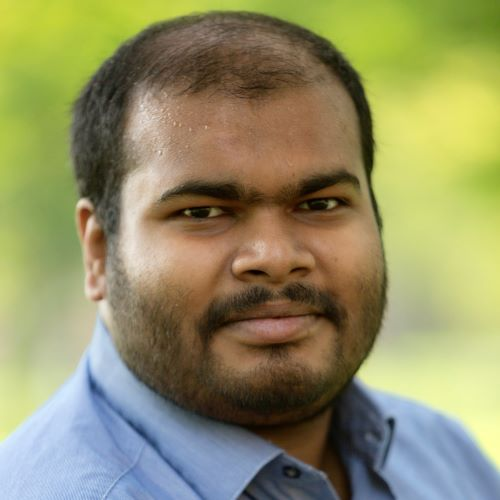

[{:#mypicture}](assets/me_2018.jpg)

[Department of Mathematics](http://math.uchicago.edu)  
[The University of Chicago](http://www.uchicago.edu)  
[5734 S. University Avenue, Chicago, Il-60637](https://maps.google.com/maps?q=5734+S.+University+Avenue,+Chicago,+Il-60637)

**Office:** Eckhart 3  
**Phone:** 773-490-5763  
**Email:** `subhadip` at `math` dot `uchicago` dot `edu`    
**My advisor:** [Danny Calegari](http://math.uchicago.edu/~dannyc/)

{:#university_shield}

## Curriculum Vitae

My CV is available [here](assets/CV.pdf). 

Here are my [Research Statement](assets/Research_Statement.pdf) and [Teaching Statement](assets/Teaching_Statement.pdf) as of Fall 2017.

I successfully defended my thesis on June 5, 2018 under the direction of Prof. [Danny Calegari](http://math.uchicago.edu/~dannyc/) and expect to receive my Ph.D. in August 2018.

I will be joining [Bowdoin College](https://www.bowdoin.edu/) [Mathematics Department](https://www.bowdoin.edu/math/) as a Visiting Assistant Professor in Fall 2018.

## Research Interests and Background

My research area is low-dimensional dynamics and topology, specifically nonabelian actions of free groups on the circle via orientation preserving homeomorphisms. I am also interested in application of algebraic topology to formal language theory. I am broadly interested in Geometric Group Theory topics like stable commutator length and quasimorphisms as well.

My papers and preprints are on my [research page](research).

I was an undergraduate at [Indian Statistical Institute, Bangalore Centre](http://www.isibang.ac.in/).

## Teaching
In Summer 2018, I will be teaching in the [Chicago Academic Achievement Program](https://ccss.uchicago.edu/page/chicago-academic-achievement-program) Summer Academy as a Mathematics Instructor. The course webpage is available [here](teaching/courses/Summer2018.CAAP).
  
Older teaching is listed on my [teaching page](teaching).

