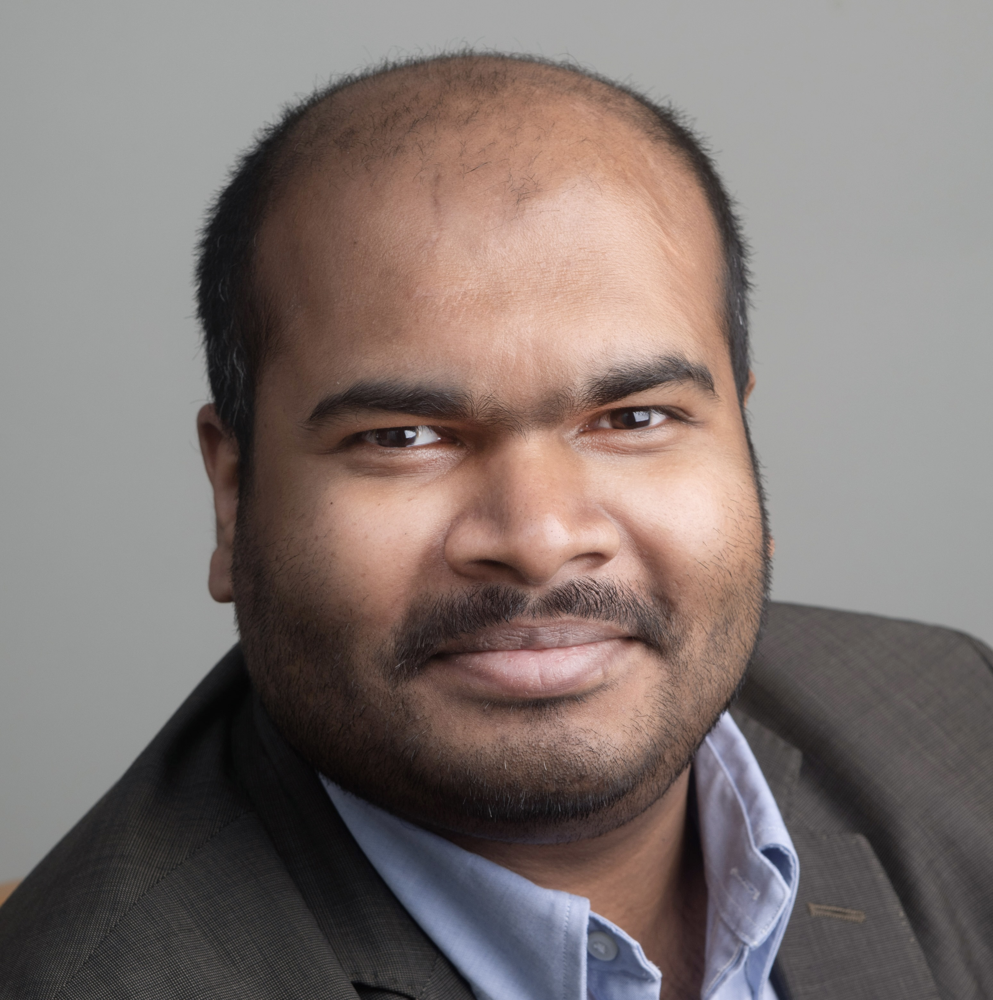

  

    [{:alt="Portrait of Subhadip Chowdhury" loading="lazy"}](assets/photos/)
    

      <a class="btn btn-primary" href="mailto:subhadip@uchicago.edu"><i class="fa-solid fa-envelope"></i> Email</a>
      <a class="btn btn-secondary" href="assets/CV.pdf"><i class="fa-solid fa-file-pdf"></i> CV (Summer 2025)</a>
    

  

  

    
Assistant Instructional Professor

    <h2>Subhadip Chowdhury</h2>
    
Mathematics educator focused on active learning, equitable assessment, and collaborative mentoring.

    <ul class="meta-list">
      <li class="meta-item"><i class="fa-solid fa-building-columns"></i> [The University of Chicago](https://www.uchicago.edu)</li>
      <li class="meta-item"><i class="fa-solid fa-location-dot"></i> Eckhart 120B · 5734 S. University Ave · Chicago, IL 60637</li>
      <li class="meta-item"><i class="fa-solid fa-user-tie"></i> Neubauer Phoenix STEM Scholars · Department of Mathematics</li>
    </ul>

    

      

        {:loading="lazy"}
      

      

        [{:loading="lazy"}](https://wooster.edu/)
        [{:loading="lazy"}](https://www.bowdoin.edu/)
        [{:loading="lazy"}](https://www.isibang.ac.in/)
      

    

  

## Featured Highlights

  

    <h4>Discovery-Based Calculus Projects</h4>
    
Active learning modules emphasizing collaborative problem solving.

    <a href="teaching" class="btn btn-secondary">View teaching materials</a>
  

  

    <h4>Alternate Grading Framework</h4>
    
Iterative feedback loops for inclusive, AI-aware assessment.

    <a href="pedagogy" class="btn btn-secondary">Read pedagogy notes</a>
  

  

    <h4>Talks & Workshops</h4>
    
Recent presentations on collaborative learning and grading redesign.

    <a href="research" class="btn btn-secondary">Explore research & talks</a>
  

## Biography

I am currently an [Assistant Instructional Professor](https://mathematics.uchicago.edu/people/profile/subhadip-chowdhury/) in the [Department of Mathematics](https://mathematics.uchicago.edu/) at [The University of Chicago](https://www.uchicago.edu/) and in the [Neubauer Phoenix STEM Scholars program](https://college.uchicago.edu/phoenix-stem) at the [Dean of Students Office](https://college.uchicago.edu/student-services/college-dean-students). I build courses around discovery-based, inclusive learning and mentor students through collaborative teaching communities.

### Appointments ###

  

    <h4>Assistant Instructional Professor</h4>
    
The University of Chicago · 2023 – Present

    <i class="fa-solid fa-users"></i> Collaborative Learning
  

  

    <h4>Visiting Assistant Professor</h4>
    
[The College of Wooster](https://wooster.edu/) · 2020 – 2023

    <i class="fa-solid fa-chalkboard-user"></i> Inquiry-driven teaching
  

  

    <h4>Visiting Assistant Professor</h4>
    
[Bowdoin College](https://www.bowdoin.edu/) · 2018 – 2020

    <i class="fa-solid fa-graduation-cap"></i> Student mentoring
  

### Education ###

  

    <h4>Ph.D. in Mathematics</h4>
    
University of Chicago · 2018

  

  

    <h4>M.S. in Mathematics</h4>
    
University of Chicago · 2014

  

  

    <h4>B.Math. (Hons.)</h4>
    
[Indian Statistical Institute](https://www.isibang.ac.in/) · 2012

  

## Teaching and Pedagogy

My pedagogical interests revolve around designing discovery-based, active, and inclusive learning environments that engage diverse students effectively. My course design emphasizes constructivist project-based learning, and alternative grading systems with clear feedback loops for iterative improvement. I’m currently updating my courses and assignments to be more AI-aware and to promote responsible use of technology. I lead our department’s Collaborative Learning program and train graduate TAs and undergraduate Lead Junior Tutors. I also advise the Neubauer Phoenix STEM Scholars.

During academic year 2025-2026, I will be a [Associate Pedagogy Fellow](https://teaching.uchicago.edu/programs/associate-pedagogy-fellows) at the Chicago Center for Teaching and Learning. Last year, I was a [Pedagogy Fellow](https://teaching.uchicago.edu/programs/pedagogy-fellows-program) and was supported by a CCTL Grant to co-lead an [Exploratory Teaching Group](https://teaching.uchicago.edu/programs/exploratory-teaching-groups) titled "Discussion on Implementing Alternate Grading and Redesigning Assessment in Math".

Material from my current and past courses are accessible through the [teaching page](teaching).

## Research Interests

My background training is in low-dimensional topological dynamics, especially the theory of nonabelian group actions on the circle. I have also contributed to the theory of formal languages, aiming to solve combinatorial group theory problems using topological methods. I am broadly interested in topics related to geometric group theory, complex dynamics, and big mapping class groups.

I received my Ph.D. from the University of Chicago under the direction of Prof. [Danny Calegari](http://math.uchicago.edu/~dannyc/). My papers and preprints are linked on my [research page](research).

